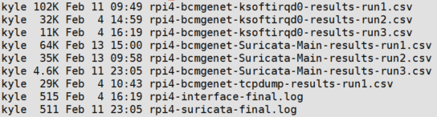

EdgeBench
====
Ansible playbooks to optimize and benchmark edge devices / embedded sized hardware

# Requirements:
1. Control machine with Ansible installed
2. A workload to test (see [**interface-test**](interface-test), [**pcap-test**](pcap-test), [**suricata-test**](suricata-test) for examples)
4. Some edge devices to test it on (e.g. RPi4, NVIDIA XAVIER)
3. (Optional) Optimization factors to attempt

# Fist Time Setup

#### Install OS and desired network configuration for edge devices

#### Ensure hostname resolution works either via DNS or local hosts file. This is important, do not skip.

```
nano /etc/hosts...
10.0.0.1        tx1
10.0.0.2        tx2
10.0.0.3        rpi3bp
10.0.0.4        rpi4
10.0.0.5        xavier
10.10.10.60     maas-1
10.10.10.61     maas-2
```
#### Build inventory.yml with device specific variables

```yaml
sensors: 
        children:
            rpi:
                hosts:
                    rpi3bp:
                        send_interface: eth7
                        capture_interface: eth0
                    rpi4:
                        send_interface: eth8
                        capture_interface: eth0
                vars:
                    ansible_user: pi
                    ansible_become_method: sudo
                    sensor_dir: /sensor
                    ansible_python_interpreter: /usr/bin/python
              
            nvidia:
                hosts:
                    tx1:
                        capture_interface: eth0
                        send_interface: eth3
                    tx2:
                        capture_interface: eth0
                        send_interface: eth3
                        rps_mask: 3E #0011 1110
                        NAPI_budget_best: 300
                        backlog_best: 1000
                        backlog_weight_best: 300
                vars:
                    ansible_user: nvidia
                    ansible_become_method: sudo
                    sensor_dir: /sensor
```

#### Build [*vars.yml*](vars.yml), [*static-controls.yml*](template-static-controls.yml), and [*variable-controls.yml*](template-variable-controls.yml) playbooks with desired experiment variables. See fully implemented tests for examples

#### Fill playbook [*template-benchmark-innerloop.yml*](template-benchmark-innerloop.yml) with the workload to test and fill in placeholders (shown as \%\%\%\%). 

```yaml
#This playbook is the "inner" loop
  - name: Launch Performance Monitor (Factors {{ current_factor_list }})
    shell: "./gather_stats.bash <<%%%PID%%%>> <<%%%SAMPLE RATE%%%>> {{ current_factor_list }}"
    args:
      chdir: "{{ experiment_dir }}/"
    register: results_async
    poll: 0
    async: 3600
    become: yes
    changed_when: false

   # <<%%%YOUR WORKLOAD TASK(S) GOES HERE.....%%%>>
   #       SEE RATELIMIT TEST FOR EXAMPLE
```

#### Replace placeholders in [*template-benchmark-middleloop.yml*](template-benchmark-middleloop.yml), [*template-benchmark-outerloop.yml*](template-benchmark-outerloop.yml) and [*template-benchmark-main.yml*](template-benchmark-main) with appropriate variable names.

```yaml
- name: Record Initial Variable Levels
    set_fact:
    A_levels: "{{A_levels}} + [ '%%%%%' ]"
    B_levels: "{{B_levels}} + [ '%%%%%' ]"
    C_levels: "{{C_levels}} + [ '%%%%%' ]"
    D_levels: "{{D_levels}} + [ '%%%%%' ]"
    E_levels: "{{E_levels}} + [ '%%%%%' ]"      
```      

#### Generate some SSH keys if you don't have them already
`ssh-keygen`

#### If first time, run *prep-playbook.yml* to setup SSH keys and dependencies. This should be the only time a password is needed. 
`ansible-playbook -i inventory.yml --ask-pass --ask-become-pass  prep-playbook.yml`

#### Run the *main* playbook once all placeholders have been filled and set:
`ansible-playbook -i inventory.yml template-benchmark-main.yml`

#### Intermediate and raw .csv results will be generated on each device and copied back to the current working directory

#### At the end of all testing, a final log will be generated that details the best level of each factor and a final performance score. 



# Tips and Tricks

#### Overriding variables from command line is done with -e:
`ansible-playbook -i inventory.yml -e "pps_limit=104000" suricata-benchmark-main.yml`

#### Limiting to only certain hosts from inventory is done with -l: 
`ansible-playbook -i inventory.yml -l nvidia,rpi4 pcap-bench-playbook.yml`

#### Play only certain factors on certain devices:
`ansible-playbook -i inventory.yml -l rpi4 -e '{"factor_combos": [E,AE,BE,ABE,CE,ACE,BCE,ABCE, DE,ADE,BDE,ABDE,CDE,ACDE,BCDE,ABCDE]}' suricata-benchmark-main.yml`

#### Jump directly into the third iteration of a optimization loop
`ansible-playbook -i inventory.yml -l rpi4 -e "test_counter=3" -e '{"significant_factors_array": [ABCE]}' -e "last_loop_best=3940539" -e "target_to_beat=5084844" suricata-benchmark-main.yml`

#### Debug "play" is very useful and can grab stdout from each device:

```yaml
- name: Send Traffic via tcpreplay.
    local_action:
        module: shell
        _raw_params: sudo tcpreplay -i {{send_interface}} -p {{interface_pps}} 1.pcap
        warn: false
    ignore_errors: yes
    register: sender
    
    #Debug
  - name: Generator Debug
    debug:
        var: sender.stdout
```

# Example of previous results


# High level Ansible Worklfow


